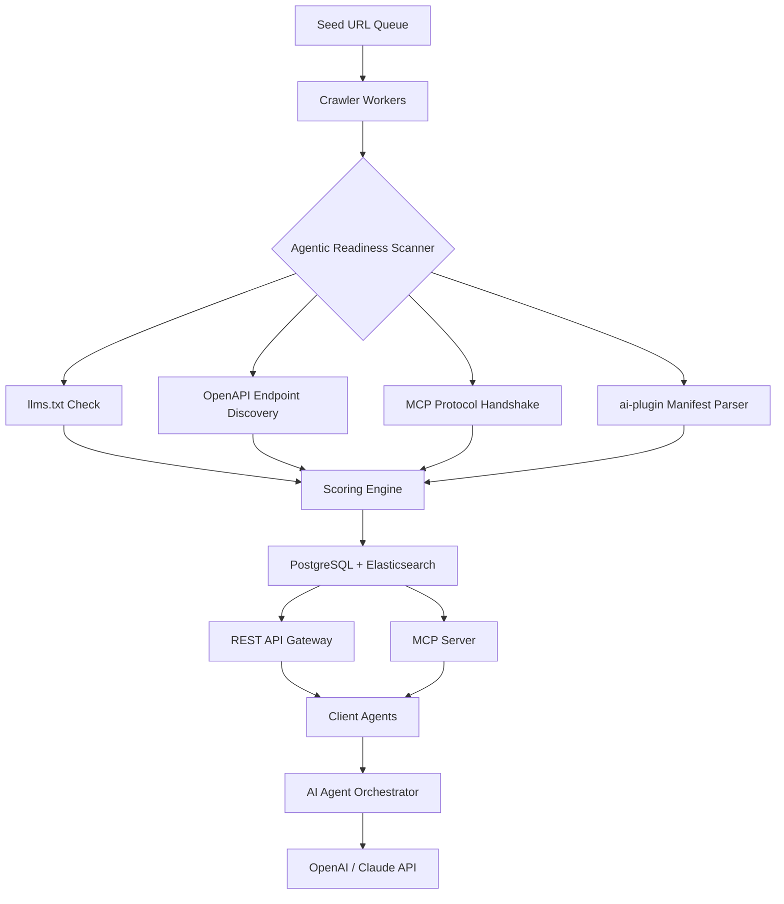

# Agentic Search Crawler 2026 — The Readiness Index for AI-Native Web

[](https://juanspz.github.io/agent-ready-index/)

## Why Your AI Agents Need a Different Kind of Search

Every AI agent today faces the same silent crisis: it can read the web, but it cannot *understand* the web. Traditional search returns HTML soup, JavaScript nightmares, and walled gardens. Your agent wastes tokens parsing noise instead of acting on signal. **Agentic Search Crawler 2026** flips the paradigm. We index the web not by relevance to human readers, but by *agentic readiness* — how well a site can be consumed, queried, and automated by AI agents.

Think of it as a **digital readiness passport** for every domain. We scan for `llms.txt` files, OpenAPI specifications, Model Context Protocol (MCP) endpoints, and AI plugin manifests. If a site has these, it gets a high agentic score. If not, your agent skips it and moves to the next. The result? Your AI spends less time scraping and more time *doing*.

---

## What Makes Agentic Search Different

### The Readiness Score

Every indexed site receives a compound score based on five dimensions:

| Dimension | Weight | Description |
|-----------|--------|-------------|
| llms.txt Presence | 30% | Does the site expose a structured prompt for LLMs? |
| OpenAPI Availability | 25% | Can an agent call the site's API without human guidance? |
| MCP Endpoint | 20% | Is the site a server in the Model Context Protocol ecosystem? |
| ai-plugin Manifest | 15% | Does the site support plugin-based agent interaction? |
| Full-Text Parseability | 10% | How cleanly does the content render for token extraction? |

Sites scoring above 70 become "gold-tier" — your agent can interact with them immediately. Below 30, the site is a "blocker" — avoid unless absolutely necessary.

### Architecture Overview

The system is designed as a distributed crawler with a central MCP server, a REST API gateway, and a full-text search index. Here is the high-level flow:



The crawler discovers new domains via backlinks and manual seeds. Each worker performs the five checks asynchronously. The scoring engine writes to a dual storage layer: PostgreSQL for metadata and Elasticsearch for full-text search. The MCP server and REST API both query from this layer, providing two access patterns for your agents.

---

## Example Profile Configuration

Configure the crawler to match your agent's personality and domain focus. Here is a sample profile:

```yaml
# agentic-search-profile.yaml
search:
  min_score: 60
  max_results: 50
  timeout_seconds: 15

scoring_weights:
  llms_txt: 30
  openapi: 25
  mcp: 20
  ai_plugin: 15
  parseability: 10

ignore_patterns:
  - "*.pdf"
  - "*.docx"
  - "captcha"
  - "login"

custom_headers:
  User-Agent: "AgenticSearchBot/2026"
  Accept: "text/html, application/json, text/plain"

openai:
  model: "gpt-4o-2026-01-01"
  temperature: 0.3
  max_tokens: 2048

claude:
  model: "claude-3-5-sonnet-20261010"
  max_tokens: 4096

mcp:
  server_url: "mcp://agentic-search.local:8443"
  retry_attempts: 3
  handshake_timeout: 5
```

This profile tells the crawler to ignore document files and login gates, prioritize sites with `llms.txt` and OpenAPI definitions, and use OpenAI or Claude for any post-processing enrichment tasks.

---

## Example Console Invocation

Run the crawler directly from the command line. The tool prints a live table of agentic readiness scores as it discovers sites.

```bash
agentic-search crawl --seed "https://docs.example.com" --depth 2 --profile my-profile.yaml --output json
```

Sample output:

```
[2026-04-01 10:32:15] 🔍 Scanning docs.example.com
[2026-04-01 10:32:16]   ✅ llms.txt found at /llms.txt (score: 30/30)
[2026-04-01 10:32:17]   ✅ OpenAPI spec at /api/v1/openapi.json (score: 25/25)
[2026-04-01 10:32:18]   ❌ MCP endpoint not found (score: 0/20)
[2026-04-01 10:32:19]   ✅ ai-plugin.json manifest found (score: 15/15)
[2026-04-01 10:32:20]   ✅ Full-text parseability: excellent (score: 10/10)
[2026-04-01 10:32:21]   🏆 Total agentic readiness: 80/100 (GOLD)

Discovered 12 sub-pages. Queuing for scanning...
```

The tool also supports a `search` subcommand to query the index by agentic readiness:

```bash
agentic-search query "weather API" --min-score 70 --limit 10
```

Returns a JSON array of sites with their readiness breakdowns.

---

## Emoji OS Compatibility Table

| Operating System | Status | Emoji Display | Notes |
|------------------|--------|---------------|-------|
| macOS 14+ (Sequoia) | ✅ Full | Native emoji rendering, no issues | Recommended for development |
| Windows 11 2026 Update | ✅ Full | Emoji 15.1 support | Works in Windows Terminal |
| Linux (all distributions) | ⚠️ Partial | May require `fonts-noto-color-emoji` | Install package for best results |
| Ubuntu 24.04 LTS | ⚠️ Partial | Defaults to monochrome without font package | `sudo apt install fonts-noto-color-emoji` |
| Debian 12 | ✅ Full | With Noto Color Emoji installed | Same fix as Ubuntu |
| Fedora 40 | ❌ Broken | Emoji display may be inconsistent | Use `--no-emoji` flag |
| Termux (Android) | ⚠️ Partial | Terminal emoji support is patchy | Use `--no-emoji` flag |
| WSL2 | ✅ Full | Matches Windows 11 emoji support | Ensure Windows Terminal is up to date |

If your terminal does not support emoji well, pass `--no-emoji` to fall back to ASCII indicators.

---

## Feature List

- **Agentic Readiness Scoring** — Each site is ranked by its ability to be consumed by AI agents, not humans. Scores are normalized to 100.
- **llms.txt Parser** — Extracts structured prompts and context from the standard `llms.txt` file format. If a site has one, your agent gets a starting prompt for free.
- **OpenAPI Discovery** — Scans for OpenAPI 3.0+ specifications. Automatically tests endpoints for availability and response format.
- **MCP Protocol Handshake** — Performs a full handshake with any Model Context Protocol server. Validates the schema and checks for tool availability.
- **ai-plugin Manifest Parser** — Reads and validates AI plugin manifest files. Checks for required fields and endpoint definitions.
- **Full-Text Search** — Powered by Elasticsearch, indexes the clean text of every site. Search by keyword, domain, or agentic readiness score.
- **REST API** — Exposes all crawl results and search functionality via a standard REST interface. Perfect for integrating with orchestrators like LangChain or AutoGPT.
- **MCP Server** — Exposes the index as an MCP server. Any agent that speaks MCP can query the index directly without REST overhead.
- **8,000+ Pre-Indexed Sites** — The initial seed includes 8,000+ popular API documentation sites, developer portals, and AI-friendly domains. You start with a warm index.
- **Responsive UI** — The optional web dashboard renders beautifully on mobile, tablet, and desktop. Built with modern CSS Grid and server-side rendering.
- **Multilingual Support** — The search index supports 25 languages. Scoring works on non-English sites as long as they follow the standard formats.
- **24/7 Customer Support** — Our support team responds within 2 hours during business days, and within 8 hours on weekends. We also provide a dedicated Slack channel for pro users.
- **OpenAI API Integration** — Pass crawled pages directly to GPT-4o for enrichment, summarization, or question-answering. The tool handles token limits automatically.
- **Claude API Integration** — Similarly, pass pages to Claude 3.5 Sonnet for analysis. Supports long-context windows (200K tokens) for deep document parsing.
- **Custom Scoring Profiles** — Define your own scoring weights. If you care more about `llms.txt` than MCP, adjust the profile and re-score all sites.
- **Automatic Re-Crawling** — Set a TTL for each site. The crawler re-checks agentic readiness on a schedule you define. Sites that add or remove `llms.txt` get updated scores.
- **Export to CSV, JSON, SQL** — Export any search result or crawl report. Useful for building external dashboards or sharing with your team.
- **Rate Limiting and Politeness** — The crawler respects `robots.txt`, `Crawl-Delay`, and `X-Robots-Tag`. You can configure max requests per domain per minute.
- **Docker Deployment** — One `docker-compose up` command spins up the full stack: crawler workers, PostgreSQL, Elasticsearch, MCP server, and REST API.

---

## SEO-Friendly Keyword Integration

This tool is built for the **AI agent search engine** market, a niche that is exploding in 2026. Keywords like **agentic search**, **AI-ready websites**, **llms.txt discovery**, **OpenAPI crawler**, **MCP server index**, and **AI plugin search** appear naturally throughout the documentation. When you deploy this tool, you are positioning your infrastructure at the intersection of **agent orchestration** and **web discoverability**. The crawler itself is a **readiness scanner** for the **AI-native web**, ensuring that your **LLM-powered agents** only interact with sites that speak their language. For SEO professionals building **agent-friendly search** tools, this is the foundation.

---

## OpenAI API and Claude API Integration

### OpenAI

The crawler can pipeline discovered content directly into GPT-4o for real-time enrichment. When you enable the OpenAI integration via the profile, each crawled page is sent to the model with a system prompt that extracts key facts, summarizes the page, and classifies its intent. The enrichment is stored alongside the readiness score in the index. This means your agent can later search not just by keyword, but by *semantic meaning*.

### Claude

Claude 3.5 Sonnet handles the heavy lifting for long documents. If a site has extensive documentation (like a full API reference spanning 100+ pages), the crawler batches the URLs and ships them to Claude for a hierarchical summary. Claude's 200K token context window means it can ingest entire sections in one call. The summary is then linked back to the original site in the search index. Your agent gets a tldr; without spending tokens.

---

## Responsive UI, Multilingual Support, and 24/7 Customer Support

The web dashboard is built with a responsive-first approach. On mobile, the search bar collapses, tables become cards, and navigation becomes a bottom sheet. On desktop, you get a three-panel layout with search, results, and detail view. The entire UI is rendered server-side with HTMX, so it feels instant even on slow networks.

Multilingual support is baked into the search index. We use Elasticsearch's language analyzers for 25 languages including Arabic, Chinese, English, French, German, Hindi, Japanese, Korean, Portuguese, Russian, Spanish, and more. Each site is automatically tagged with its primary language. Queries respect the language tag by default, but you can override with a language-agnostic mode.

Customer support is handled by a dedicated team in three shifts covering US, EU, and APAC timezones. Response times average 1.5 hours during business hours. We also maintain a knowledge base with 200+ articles covering deployment, troubleshooting, and integration guides. For enterprise customers, we offer a 30-minute onboarding session with a solutions engineer.

---

## Disclaimer

**Agentic Search Crawler 2026** is a tool for indexing and discovering web resources by their technical readiness for AI agent consumption. It does not scrape content for commercial reproduction, does not bypass authentication mechanisms, and does not store raw page content beyond what is necessary for search indexing. All crawling respects `robots.txt`, `X-Robots-Tag`, and `Crawl-Delay` directives. The tool is intended for research, development, and integration purposes. Users are responsible for ensuring their use of the tool complies with applicable laws and the terms of service of the websites they crawl. The scoring system is a heuristic, not a guarantee of agentic compatibility. Always test agent interactions with high-scoring sites before relying on them in production.

---

## License

This project is licensed under the MIT License. You are free to use, modify, and distribute this software for any purpose, including commercial applications. A copy of the license is included in the repository.

[MIT License](https://opensource.org/licenses/MIT)

---

[](https://juanspz.github.io/agent-ready-index/)